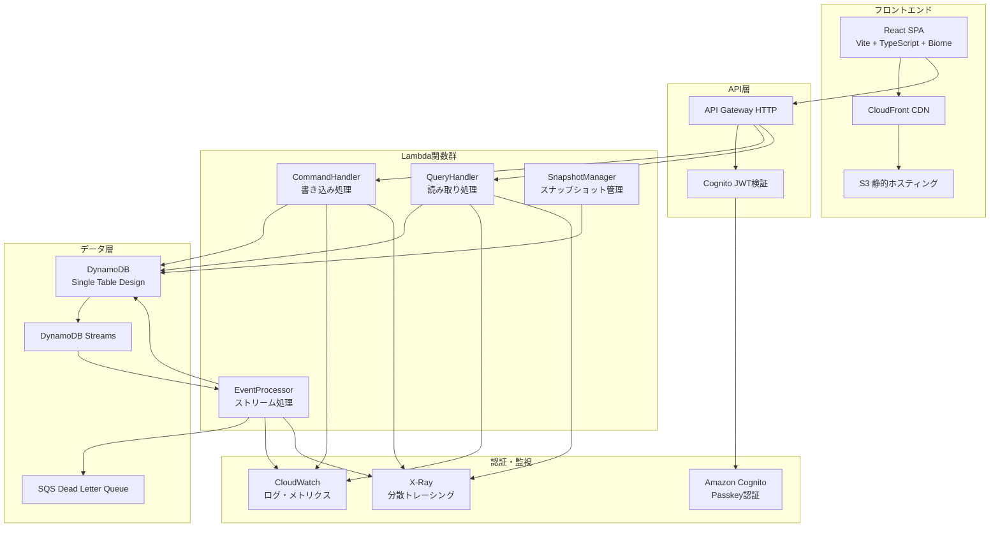

# 家族用 ToDo アプリ - AWS サーバーレス版 設計書

## 概要

本システムは、イベントソーシング + CQRS アーキテクチャを採用したサーバーレス家族用 ToDo アプリです。AWS Lambda（Rust）、DynamoDB、API Gateway、Cognito を中心とした構成で、高可用性・低コスト・高セキュリティを実現します。

## アーキテクチャ

### システム全体アーキテクチャ



### CQRS + イベントソーシング設計

#### コマンド側（書き込み）

- **CommandHandler**: ToDo の作成・更新・削除・完了コマンドを処理
- **イベント生成**: 各操作をイベントとして DynamoDB に永続化
- **楽観的ロック**: バージョン番号による同時実行制御

#### クエリ側（読み取り）

- **QueryHandler**: ToDo 一覧・詳細・履歴の取得
- **プロジェクション**: イベントから構築された読み取り最適化ビュー
- **EventProcessor**: DynamoDB Streams でプロジェクション更新

## コンポーネントと インターフェース

### 1. ドメインモデル

#### TodoId（ULID 実装）

```rust
#[derive(Debug, Clone, PartialEq, Eq, Serialize, Deserialize)]
pub struct TodoId(String);

impl TodoId {
    pub fn new() -> Self {
        Self(Ulid::new().to_string())
    }

    pub fn timestamp_ms(&self) -> Option<u64> {
        Ulid::from_string(&self.0).ok().map(|ulid| ulid.timestamp_ms())
    }
}
```

#### TodoEvent（イベント定義）

```rust
#[derive(Debug, Clone, Serialize, Deserialize)]
#[serde(tag = "event_type", rename_all = "snake_case")]
pub enum TodoEvent {
    TodoCreatedV2 {
        event_id: String,
        todo_id: TodoId,
        title: String,
        description: Option<String>,
        tags: Vec<String>,
        created_by: UserId,
        timestamp: DateTime<Utc>,
    },
    TodoUpdatedV1 {
        event_id: String,
        todo_id: TodoId,
        title: Option<String>,
        description: Option<String>,
        updated_by: UserId,
        timestamp: DateTime<Utc>,
    },
    TodoCompletedV1 {
        event_id: String,
        todo_id: TodoId,
        completed_by: UserId,
        timestamp: DateTime<Utc>,
    },
    TodoDeletedV1 {
        event_id: String,
        todo_id: TodoId,
        deleted_by: UserId,
        reason: Option<String>,
        timestamp: DateTime<Utc>,
    },
}
```

#### Todo（アグリゲート）

```rust
#[derive(Debug, Clone, Serialize, Deserialize)]
pub struct Todo {
    pub id: TodoId,
    pub title: String,
    pub description: Option<String>,
    pub tags: Vec<String>,
    pub completed: bool,
    pub created_by: UserId,
    pub created_at: DateTime<Utc>,
    pub updated_at: DateTime<Utc>,
    pub version: u64,
}

impl Todo {
    pub fn apply(&mut self, event: TodoEvent) {
        match event {
            TodoEvent::TodoCreatedV2 { todo_id, title, description, tags, created_by, timestamp, .. } => {
                self.id = todo_id;
                self.title = title;
                self.description = description;
                self.tags = tags;
                self.created_by = created_by;
                self.created_at = timestamp;
                self.updated_at = timestamp;
                self.version = 1;
            },
            TodoEvent::TodoUpdatedV1 { title, description, timestamp, .. } => {
                if let Some(new_title) = title {
                    self.title = new_title;
                }
                if let Some(new_desc) = description {
                    self.description = new_desc;
                }
                self.updated_at = timestamp;
                self.version += 1;
            },
            TodoEvent::TodoCompletedV1 { timestamp, .. } => {
                self.completed = true;
                self.updated_at = timestamp;
                self.version += 1;
            },
            // 削除は論理削除フラグまたは別途処理
            _ => {}
        }
    }
}
```

### 2. DynamoDB Single Table Design

#### テーブル構造

| 属性       | 型  | 説明                             |
| ---------- | --- | -------------------------------- |
| PK         | S   | パーティションキー               |
| SK         | S   | ソートキー                       |
| EntityType | S   | Event/Projection/Snapshot/Family |
| GSI1PK     | S   | GSI1 パーティションキー          |
| GSI1SK     | S   | GSI1 ソートキー                  |
| Data       | M   | エンティティ固有データ           |
| Version    | N   | 楽観的ロックバージョン           |
| TTL        | N   | 有効期限（スナップショット用）   |
| CreatedAt  | S   | ISO8601 作成日時                 |
| UpdatedAt  | S   | ISO8601 更新日時                 |

#### アクセスパターン

| パターン         | PK                               | SK                              | 用途           |
| ---------------- | -------------------------------- | ------------------------------- | -------------- |
| イベント保存     | `FAMILY#{familyId}`              | `EVENT#{ulid}`                  | 時系列イベント |
| 現在 ToDo        | `FAMILY#{familyId}`              | `TODO#CURRENT#{todoId}`         | 最新状態       |
| ToDo 履歴        | `FAMILY#{familyId}`              | `TODO#EVENT#{todoId}#{ulid}`    | 特定 ToDo 履歴 |
| スナップショット | `FAMILY#{familyId}`              | `TODO#SNAPSHOT#{todoId}#{ulid}` | 定期スナップ   |
| アクティブ ToDo  | GSI1: `FAMILY#{familyId}#ACTIVE` | `{ulid}`                        | 未完了一覧     |

### 3. Lambda 関数設計

#### CommandHandler

```rust
pub async fn handle_command(
    event: LambdaEvent<ApiGatewayProxyRequest>,
    context: Context,
) -> Result<ApiGatewayProxyResponse, Error> {
    let command = parse_command(&event.payload)?;
    let family_id = extract_family_id(&event.payload)?;

    match command {
        Command::CreateTodo { title, description, tags } => {
            let todo_event = TodoEvent::TodoCreatedV2 {
                event_id: Ulid::new().to_string(),
                todo_id: TodoId::new(),
                title,
                description,
                tags,
                created_by: get_user_id(&event.payload)?,
                timestamp: Utc::now(),
            };

            save_event(&DYNAMODB_CLIENT, &family_id, todo_event).await?;
            Ok(success_response(201, "Todo created"))
        },
        Command::UpdateTodo { todo_id, updates } => {
            update_with_optimistic_lock(&family_id, &todo_id, updates).await?;
            Ok(success_response(200, "Todo updated"))
        },
        // 他のコマンド処理...
    }
}
```

#### QueryHandler

```rust
pub async fn handle_query(
    event: LambdaEvent<ApiGatewayProxyRequest>,
    context: Context,
) -> Result<ApiGatewayProxyResponse, Error> {
    let query = parse_query(&event.payload)?;
    let family_id = extract_family_id(&event.payload)?;

    match query {
        Query::ListTodos { status, limit } => {
            let todos = if status == Some("active") {
                query_active_todos(&family_id, limit).await?
            } else {
                query_all_todos(&family_id, limit).await?
            };
            Ok(json_response(200, todos))
        },
        Query::GetTodo { todo_id } => {
            let todo = get_todo_projection(&family_id, &todo_id).await?;
            Ok(json_response(200, todo))
        },
        Query::GetTodoHistory { todo_id } => {
            let events = get_todo_events(&family_id, &todo_id).await?;
            Ok(json_response(200, events))
        },
    }
}
```

#### EventProcessor

```rust
pub async fn handle_stream_event(
    event: LambdaEvent<DynamoDbEvent>,
) -> Result<BatchItemFailures, Error> {
    let mut failures = Vec::new();

    for record in event.payload.records {
        match process_record(&record).await {
            Ok(_) => continue,
            Err(e) if is_retryable(&e) => {
                failures.push(BatchItemFailure {
                    item_identifier: record.event_sequence_number,
                });
            },
            Err(e) => {
                send_to_dlq(&record, &e).await?;
            }
        }
    }

    Ok(BatchItemFailures { batch_item_failures: failures })
}

async fn process_record(record: &DynamoDbEventRecord) -> Result<(), ProcessError> {
    if let Some(new_image) = &record.dynamodb.new_image {
        if let Some(entity_type) = new_image.get("EntityType") {
            if entity_type.s.as_ref() == Some(&"Event".to_string()) {
                let event: TodoEvent = parse_event_from_record(record)?;
                update_projection(event).await?;

                // スナップショット作成判定
                check_and_create_snapshot(&event.todo_id()).await?;
            }
        }
    }
    Ok(())
}
```

## データモデル

### イベントストア設計

- **イベントの不変性**: 一度保存されたイベントは変更不可
- **時系列順序**: ULID による自然な時系列ソート
- **バージョニング**: イベントスキーマのバージョン管理とアップキャスト
- **パーティション戦略**: 家族 ID によるパーティション分散

### プロジェクション設計

- **現在状態**: 最新の ToDo 状態を効率的に取得
- **アクティブインデックス**: 未完了 ToDo の高速検索
- **結果整合性**: イベント処理による非同期更新

### スナップショット戦略

```rust
const SNAPSHOT_EVENT_THRESHOLD: usize = 100;
const SNAPSHOT_AGE_THRESHOLD_DAYS: i64 = 7;

pub async fn create_snapshot_if_needed(
    todo_id: &TodoId,
    event_count: usize,
    last_snapshot_date: Option<DateTime<Utc>>,
) -> Result<(), Error> {
    let should_create = event_count >= SNAPSHOT_EVENT_THRESHOLD ||
        last_snapshot_date.map_or(true, |date| {
            Utc::now().signed_duration_since(date).num_days() >= SNAPSHOT_AGE_THRESHOLD_DAYS
        });

    if should_create {
        let snapshot = build_snapshot_from_events(todo_id).await?;
        save_snapshot(&snapshot).await?;
        set_old_snapshots_ttl(todo_id).await?;
    }

    Ok(())
}
```

## エラーハンドリング

### エラー分類と処理戦略

#### リトライ可能エラー

- `ThrottlingException`: 指数バックオフでリトライ
- `ServiceUnavailable`: 短期間のリトライ
- `TemporaryFailure`: 一時的な障害

#### リトライ不可エラー

- `ValidationException`: バリデーションエラー
- `ConditionalCheckFailedException`: 楽観的ロック競合
- `ResourceNotFoundException`: リソース不存在

#### エラーハンドリング実装

```rust
#[derive(Debug, thiserror::Error)]
pub enum TodoError {
    #[error("Validation error: {0}")]
    Validation(String),

    #[error("Concurrent modification detected")]
    ConcurrentModification,

    #[error("Todo not found: {0}")]
    NotFound(String),

    #[error("DynamoDB error: {0}")]
    DynamoDb(String),

    #[error("Authentication error: {0}")]
    Authentication(String),
}

pub async fn update_with_retry(
    family_id: &str,
    todo_id: &TodoId,
    updates: TodoUpdates,
    max_retries: u32,
) -> Result<Todo, TodoError> {
    let mut retries = 0;

    loop {
        let todo = get_todo(family_id, todo_id).await?;

        match update_todo_with_lock(family_id, &todo, updates.clone()).await {
            Ok(updated) => return Ok(updated),
            Err(TodoError::ConcurrentModification) if retries < max_retries => {
                retries += 1;
                let delay = Duration::from_millis(100 * (1 << retries));
                tokio::time::sleep(delay).await;
            },
            Err(e) => return Err(e),
        }
    }
}
```

## テスト戦略

### テストピラミッド

1. **ユニットテスト**: ドメインロジック、イベント適用、バリデーション
2. **統合テスト**: DynamoDB 操作、Lambda 関数、API エンドポイント
3. **E2E テスト**: フロントエンドからバックエンドまでの完全フロー
4. **負荷テスト**: パフォーマンス要件の検証

### テスト環境

- **ローカル**: DynamoDB Local、LocalStack
- **CI/CD**: GitHub Actions、テスト専用 AWS アカウント
- **負荷テスト**: K6 によるパフォーマンステスト

### テストデータ管理

```rust
pub struct TestFixture {
    pub family_id: String,
    pub user_id: UserId,
    pub todos: Vec<Todo>,
}

impl TestFixture {
    pub async fn setup() -> Self {
        let family_id = format!("test-family-{}", Ulid::new());
        let user_id = UserId::new();

        // テストデータ作成
        let todos = create_test_todos(&family_id, &user_id).await;

        Self { family_id, user_id, todos }
    }

    pub async fn cleanup(&self) {
        // テストデータクリーンアップ
        cleanup_test_data(&self.family_id).await;
    }
}
```

この設計書では、要件定義書で定義した機能要件を技術的に実現するための詳細な設計を提供しています。イベントソーシング、CQRS、DynamoDB Single Table Design、楽観的ロック、エラーハンドリングなど、すべての重要な技術要素を網羅しています。
