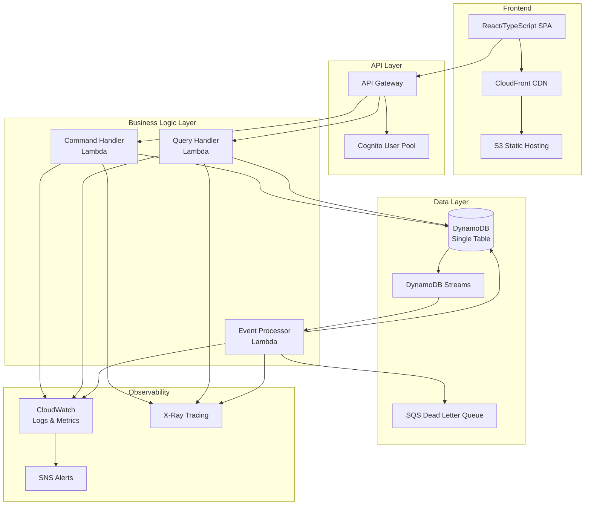
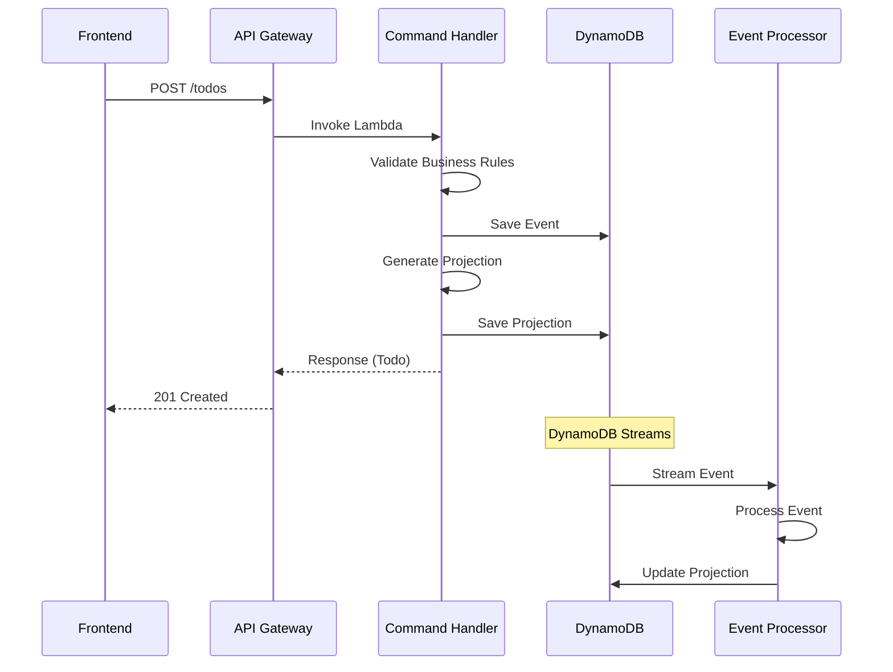
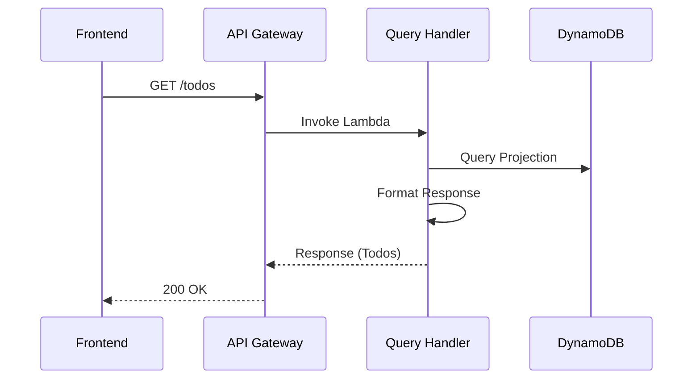

# アーキテクチャ概要

## システム全体像

Family Todo App は、イベントソーシング + CQRS パターンを採用した AWS サーバーレスアプリケーションです。
家族間での ToDo 共有を目的とし、高い可用性、スケーラビリティ、監査可能性を重視して設計されています。

## アーキテクチャ図



## 主要なアーキテクチャパターン

### 1. イベントソーシング (Event Sourcing)

すべての状態変更を「イベント」として記録し、現在の状態はイベントの再生によって構築されます。

**利点:**
- 完全な監査証跡
- 時間旅行機能（任意の時点の状態を復元）
- デバッグの容易さ
- ビジネス要件の変更に対する柔軟性

**実装:**
```rust
pub enum TodoEvent {
    TodoCreatedV2 {
        event_id: EventId,
        todo_id: TodoId,
        title: String,
        created_by: UserId,
        timestamp: DateTime<Utc>,
    },
    TodoUpdatedV1 { /* ... */ },
    TodoCompletedV1 { /* ... */ },
    TodoDeletedV1 { /* ... */ },
}
```

### 2. CQRS (Command Query Responsibility Segregation)

読み取り（Query）と書き込み（Command）の責任を分離し、それぞれを独立して最適化します。

**構成要素:**
- **Command Handler**: 書き込み処理、イベント生成
- **Query Handler**: 読み取り処理、プロジェクション参照
- **Event Processor**: イベントからプロジェクションへの更新

### 3. Single Table Design

DynamoDB の効率的な利用のため、すべてのエンティティを単一テーブルに格納します。

```
PK                     | SK                     | 用途
-----------------------|------------------------|-------------------
FAMILY#{family_id}     | EVENT#{event_id}       | イベント
FAMILY#{family_id}     | TODO#CURRENT#{todo_id} | 現在のTodo状態
FAMILY#{family_id}     | FAMILY#META           | 家族メタデータ
FAMILY#{family_id}#ACTIVE | {todo_id}          | アクティブTodo(GSI1)
```

## レイヤー別詳細

### フロントエンド層

**技術スタック:**
- React 18 + TypeScript
- Vite (ビルドツール)
- Tailwind CSS (スタイリング)
- Tanstack Query (状態管理)

**特徴:**
- SPA (Single Page Application)
- レスポンシブデザイン
- PWA 対応準備
- Amazon Cognito 認証統合

### API 層

**API Gateway:**
- REST API エンドポイント提供
- CORS 設定
- レート制限
- JWT 認証 (Cognito)
- リクエスト・レスポンス変換

**認証:**
- Amazon Cognito User Pool
- JWT トークンベース認証
- MFA サポート
- 将来的に WebAuthn (Passkey) 対応

### ビジネスロジック層

#### Command Handler Lambda
**責任:**
- ビジネスルールの検証
- イベント生成・保存
- 楽観的ロック制御

**特徴:**
- Rust 実装
- 同期処理
- 書き込み専用 (DynamoDB への PUT/UPDATE)

#### Query Handler Lambda
**責任:**
- データの取得・整形
- ページネーション
- フィルタリング・ソート

**特徴:**
- Rust 実装
- 読み取り専用 (DynamoDB の GET/QUERY)
- キャッシュ活用

#### Event Processor Lambda  
**責任:**
- イベントからプロジェクションの更新
- 非同期処理
- エラーハンドリング・リトライ

**特徴:**
- DynamoDB Streams トリガー
- バッチ処理対応
- Dead Letter Queue 統合

### データ層

#### DynamoDB
**設計原則:**
- Single Table Design
- アクセスパターン最適化
- GSI による効率的なクエリ

**スケーラビリティ:**
- Pay-per-Request 課金
- 自動スケーリング
- Multi-AZ 可用性

#### DynamoDB Streams
**用途:**
- イベント配信
- 結果整合性の実現
- リアルタイム処理トリガー

### 可観測性層

#### CloudWatch
- **Logs**: 構造化ログ出力
- **Metrics**: カスタムメトリクス
- **Alarms**: 異常検知とアラート

#### AWS X-Ray
- **分散トレーシング**: リクエストフロー可視化
- **パフォーマンス分析**: ボトルネック特定
- **エラー分析**: 例外フロー追跡

## データフロー

### 書き込みフロー（コマンド）



### 読み取りフロー（クエリ）



## 設計原則

### 1. 12-Factor App
- **環境変数による設定**
- **ステートレス処理**
- **プロセス分離**
- **ログのストリーム化**

### 2. 障害に対する設計
- **Circuit Breaker パターン**
- **指数バックオフリトライ**
- **Dead Letter Queue**
- **Graceful Degradation**

### 3. セキュリティ
- **最小権限の原則 (IAM)**
- **データ暗号化 (保存時・転送時)**
- **定期的なセキュリティ監査**
- **OWASP セキュリティ対策**

### 4. パフォーマンス
- **Lambda Cold Start 最適化**
- **DynamoDB ホットパーティション回避**
- **効率的なデータモデル**
- **適切なキャッシュ戦略**

## スケーラビリティ特性

### 垂直スケーラビリティ
- Lambda メモリサイズ調整 (128MB-10GB)
- DynamoDB Read/Write Capacity 調整

### 水平スケーラビリティ  
- Lambda 自動スケーリング (1000同時実行)
- DynamoDB 自動パーティショニング
- API Gateway 自動負荷分散

### 地理的分散
- Multi-Region デプロイ対応
- CloudFront グローバル配信
- Cross-Region レプリケーション

## 運用特性

### 監視
- **SLI/SLO 定義**
  - 可用性: 99.9%
  - レスポンス時間: P95 < 200ms
  - エラー率: < 0.1%

### アラート
- **エラー率閾値**: 5エラー/5分
- **レイテンシ閾値**: 平均5秒
- **DLQ メッセージ**: 1件以上

### バックアップ・復旧
- **DynamoDB**: Point-in-Time Recovery
- **RTO**: 1時間以内
- **RPO**: 5分以内

## 今後の拡張計画

### Phase 1: 機能拡張
- リアルタイム同期 (WebSocket)
- プッシュ通知
- ファイル添付

### Phase 2: プラットフォーム拡張
- モバイルアプリ
- デスクトップアプリ
- 外部API統合

### Phase 3: AI/ML統合
- Todo 推奨システム
- 自動分類
- 生産性分析

## 制約と考慮事項

### 技術的制約
- **DynamoDB 項目サイズ**: 400KB制限
- **Lambda 実行時間**: 15分制限
- **API Gateway タイムアウト**: 30秒制限

### ビジネス制約
- **家族サイズ**: 20人まで
- **Todo 履歴**: 1年間保持
- **リージョン**: 日本のみ対応

### コスト制約
- **月間コスト目標**: $10以下/家族
- **Free Tier 活用**: 初期段階
- **Pay-per-Use モデル**: スケール時

## 参考資料

- [Domain-Driven Design](https://www.amazon.co.jp/dp/4798121967)
- [Building Event-Driven Microservices](https://www.oreilly.com/library/view/building-event-driven-microservices/9781492057888/)
- [AWS Well-Architected Framework](https://aws.amazon.com/jp/architecture/well-architected/)
- [DynamoDB Developer Guide](https://docs.aws.amazon.com/amazondynamodb/latest/developerguide/)