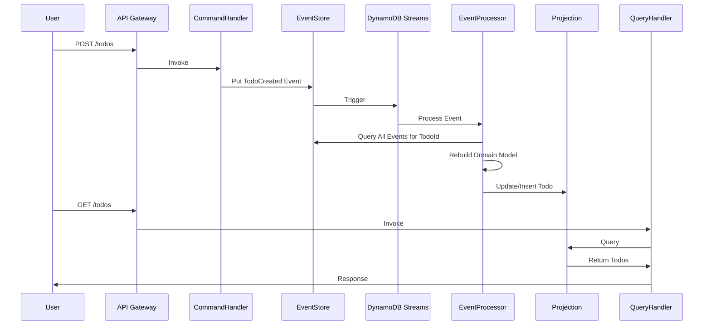

# 🗺️ ToDo アプリ ― AWS サーバーレス版 プランニングドキュメント

**目的**: Rust + React/TypeScript で実装する家族用 ToDo 共有アプリを、低コスト・高セキュリティで AWS サーバーレスにデプロイする。イベントソーシングアーキテクチャを採用し、シンプルな UI/UX を実現する。

---

## 1. システム全体概要

| 層             | サービス                                          | 主な役割                                            |
| -------------- | ------------------------------------------------- | --------------------------------------------------- |
| **フロント**   | **S3** 静的ウェブホスティング／**CloudFront** CDN | React SPA (Vite + TS) 配信                          |
| **API**        | **API Gateway (HTTP)**                            | REST エンドポイント・CORS・Cognito JWT 検証         |
|                | **AWS Lambda (Rust)**                             | コマンド/クエリハンドラー・イベントプロセッサー     |
| **認証**       | **Amazon Cognito** (ユーザープール)               | Passkey (WebAuthn) + リフレッシュトークン           |
| **DB**         | **Amazon DynamoDB**                               | イベントストア + プロジェクション（読み取りモデル） |
| **ストリーム** | **DynamoDB Streams**                              | イベント駆動での読み取りモデル更新                  |
| **監視**       | **CloudWatch Logs / Metrics**                     | Lambda 実行ログ・アラーム                           |
| **CI/CD**      | **GitHub Actions + AWS CLI / SAM**                | ビルド・テスト・デプロイ自動化                      |
| **IaC**        | **AWS SAM** (初期) → 将来 **Terraform/CDK**       | インフラ定義・再現                                  |

---

## 2. リポジトリ構成（モノレポ）

```text
/
├── infra/              # SAM / Terraform テンプレート
│   ├── template.yaml   # SAM main
│   └── samconfig.toml
├── backend/            # Rust Lambda 関数群
│   ├── command-handler/    # 書き込み側
│   ├── query-handler/      # 読み取り側
│   ├── event-processor/    # ストリーム処理
│   └── shared/            # 共通ドメインモデル
├── frontend/           # React/TS (Vite)
│   ├── src/
│   └── package.json
├── .github/
│   └── workflows/
│       ├── backend.yml
│       └── frontend.yml
└── docs/               # ADR, API Spec, etc.
```

---

## 3. DynamoDB 設計（イベントソーシング）

### イベントストアテーブル

| 属性         | 型  | 説明                                                         |
| ------------ | --- | ------------------------------------------------------------ |
| **PK**       | S   | `FAMILY#${familyId}`                                         |
| **SK**       | S   | `EVENT#${timestamp}#${eventId}`                              |
| EventType    | S   | `TodoCreated`, `TodoUpdated`, `TodoCompleted`, `TodoDeleted` |
| EventVersion | N   | イベントスキーマバージョン                                   |
| TodoId       | S   | UUID v4                                                      |
| UserId       | S   | 実行者 ID                                                    |
| Timestamp    | S   | ISO8601                                                      |
| Data         | M   | イベント固有のデータ                                         |

### プロジェクションテーブル（読み取りモデル）

| 属性           | 型   | 説明                 |
| -------------- | ---- | -------------------- |
| **PK**         | S    | `FAMILY#${familyId}` |
| **SK**         | S    | `TODO#${todoId}`     |
| TodoId         | S    | UUID                 |
| Title          | S    | タイトル             |
| Description    | S    | 説明（オプション）   |
| Completed      | BOOL | 完了フラグ           |
| CreatedAt      | S    | 作成日時             |
| CreatedBy      | S    | 作成者               |
| LastModifiedAt | S    | 最終更新日時         |
| LastModifiedBy | S    | 最終更新者           |
| Version        | N    | 楽観的ロック用       |

### GSI 設計

- **GSI1**: アクティブな ToDo の効率的取得
  - PK: `FAMILY#${familyId}#ACTIVE`
  - SK: `CREATED#${createdAt}`
  - 条件: Completed = false のアイテムのみ

---

## 4. Lambda 関数アーキテクチャ

| 関数名               | 役割                             | トリガー               |
| -------------------- | -------------------------------- | ---------------------- |
| `TodoCommandHandler` | 書き込み処理（イベント生成）     | API Gateway (POST/PUT) |
| `TodoEventProcessor` | イベントからプロジェクション更新 | DynamoDB Streams       |
| `TodoQueryHandler`   | 読み取り処理                     | API Gateway (GET)      |

### IAM ロール設計

| ロール               | 必要な権限                                                                                               |
| -------------------- | -------------------------------------------------------------------------------------------------------- |
| `CommandHandlerRole` | `dynamodb:PutItem` (EventStore), `logs:*`                                                                |
| `EventProcessorRole` | `dynamodb:GetItem/Query/PutItem/DeleteItem` (両テーブル), `dynamodb:DescribeStream/GetRecords`, `logs:*` |
| `QueryHandlerRole`   | `dynamodb:GetItem/Query` (Projection), `logs:*`                                                          |

---

## 5. API エンドポイント設計

| メソッド | パス                   | 説明          | ハンドラー     |
| -------- | ---------------------- | ------------- | -------------- |
| POST     | `/todos`               | ToDo 作成     | CommandHandler |
| PUT      | `/todos/{id}`          | ToDo 更新     | CommandHandler |
| POST     | `/todos/{id}/complete` | ToDo 完了     | CommandHandler |
| DELETE   | `/todos/{id}`          | ToDo 削除     | CommandHandler |
| GET      | `/todos`               | ToDo 一覧取得 | QueryHandler   |
| GET      | `/todos/{id}/history`  | 履歴取得      | QueryHandler   |

---

## 6. イベントフロー



---

## 7. デプロイフロー（GitHub Actions）

### Backend ワークフロー (`backend.yml`)

```yaml
name: Deploy Backend
on:
  push:
    branches: [main]
    paths:
      - "backend/**"
      - "infra/**"

jobs:
  deploy:
    runs-on: ubuntu-latest
    steps:
      - uses: actions/checkout@v4
      - uses: actions/setup-node@v4
      - uses: aws-actions/setup-sam@v2
      - uses: dtolnay/rust-toolchain@stable
        with:
          targets: aarch64-unknown-linux-musl

      - name: Build and Test
        run: |
          cd backend
          cargo test --all
          cargo clippy -- -D warnings

      - name: SAM Build
        run: sam build --use-container

      - uses: aws-actions/configure-aws-credentials@v4
        with:
          role-to-assume: ${{ secrets.AWS_DEPLOY_ROLE }}
          aws-region: ap-northeast-1

      - name: SAM Deploy
        run: sam deploy --no-confirm-changeset --no-fail-on-empty-changeset
```

### Frontend ワークフロー (`frontend.yml`)

```yaml
name: Deploy Frontend
on:
  push:
    branches: [main]
    paths:
      - "frontend/**"

jobs:
  deploy:
    runs-on: ubuntu-latest
    steps:
      - uses: actions/checkout@v4
      - uses: actions/setup-node@v4
        with:
          node-version: "20"

      - name: Install and Build
        run: |
          cd frontend
          npm ci
          npm run test
          npm run build
        env:
          VITE_API_ENDPOINT: ${{ secrets.API_ENDPOINT }}
          VITE_USER_POOL_ID: ${{ secrets.USER_POOL_ID }}
          VITE_USER_POOL_CLIENT_ID: ${{ secrets.USER_POOL_CLIENT_ID }}

      - uses: aws-actions/configure-aws-credentials@v4
        with:
          role-to-assume: ${{ secrets.AWS_DEPLOY_ROLE }}
          aws-region: ap-northeast-1

      - name: Deploy to S3
        run: |
          aws s3 sync frontend/dist s3://${{ secrets.S3_BUCKET }} --delete
          aws cloudfront create-invalidation \
            --distribution-id ${{ secrets.CF_DISTRIBUTION_ID }} \
            --paths "/*"
```

---

## 8. ローカル開発環境

| ツール             | 用途                     | 設定                                          |
| ------------------ | ------------------------ | --------------------------------------------- |
| **SAM CLI**        | Lambda ローカル実行      | `sam local start-api --warm-containers EAGER` |
| **DynamoDB Local** | DB エミュレーション      | Docker で起動、ポート 8000                    |
| **LocalStack**     | Cognito エミュレーション | 認証フロー検証用                              |
| **mkcert**         | HTTPS ローカル証明書     | Passkey 動作確認用                            |
| **cargo-watch**    | Rust 自動リビルド        | `cargo watch -x test`                         |

### Docker Compose 設定例

```yaml
version: "3.8"
services:
  dynamodb-local:
    image: amazon/dynamodb-local:latest
    ports:
      - "8000:8000"
    command: "-jar DynamoDBLocal.jar -sharedDb -inMemory"

  localstack:
    image: localstack/localstack:latest
    ports:
      - "4566:4566"
    environment:
      - SERVICES=cognito-idp
      - DEBUG=1
```

---

## 9. 開発マイルストーン

| Sprint | ゴール               | 完了条件 (DoD)                                       |
| ------ | -------------------- | ---------------------------------------------------- |
| **0**  | 基盤セットアップ     | SAM テンプレート作成、CI/CD パイプライン稼働         |
| **1**  | イベントストア実装   | CommandHandler でイベント保存、DynamoDB Streams 設定 |
| **2**  | イベントプロセッサー | EventProcessor でプロジェクション更新確認            |
| **3**  | 認証統合             | Cognito Passkey 登録・ログイン → JWT 検証            |
| **4**  | クエリ API           | QueryHandler で ToDo 一覧・履歴取得                  |
| **5**  | フロントエンド       | React でシンプルな ToDo 管理 UI 実装                 |
| **6**  | 統合テスト           | E2E テスト、パフォーマンス検証（p95 < 200ms）        |

---

## 10. コスト試算（月間 5 家族 × 1,000 リクエスト）

| サービス         | 想定使用量                    | 月額費用          |
| ---------------- | ----------------------------- | ----------------- |
| Lambda           | 15,000 実行（3 関数 × 5,000） | **$0** (無料枠内) |
| API Gateway      | 5,000 リクエスト              | **$0.005**        |
| DynamoDB         | 2 テーブル、オンデマンド      | **$0** (無料枠内) |
| DynamoDB Streams | 5,000 レコード                | **$0**            |
| Cognito          | 5 MAU                         | **$0**            |
| S3 + CloudFront  | 100MB 転送                    | **$0**            |
| **合計**         |                               | **約 $0.01/月**   |

---

## 11. セキュリティ & 運用

### セキュリティ対策

- **認証**: Cognito + Passkey (WebAuthn)
- **通信**: TLS 1.2+ 強制（CloudFront + ACM）
- **CORS**: API Gateway で厳格に設定
- **最小権限**: IAM ロールを機能別に分離
- **暗号化**: DynamoDB 保存時暗号化（SSE）

### 監視・アラート

- **メトリクス**: Lambda Duration、Error Rate
- **アラーム**: エラー率 > 1% で SNS 通知
- **ログ**: CloudWatch Logs（構造化ログ）
- **トレーシング**: X-Ray でリクエスト追跡（将来）

### バックアップ

- **イベントストア**: PITR 有効（7 日間）
- **S3**: バージョニング有効

---

## 12. 技術的な学習ポイント

1. **イベントソーシング**

   - イベントが唯一の真実の源
   - 完全な監査証跡
   - タイムトラベルデバッグ可能

2. **CQRS パターン**

   - コマンドとクエリの責務分離
   - 最終的整合性の実装

3. **DynamoDB 設計**

   - Single Table Design
   - DynamoDB Streams の活用
   - 効率的なアクセスパターン

4. **サーバーレスアーキテクチャ**

   - イベント駆動設計
   - 関数の適切な分割
   - コールドスタート対策

5. **Rust での AWS Lambda**
   - 高パフォーマンス実装
   - 型安全性の活用
   - cargo-lambda の使用

---

## 13. 将来の拡張可能性

- **通知機能**: EventBridge + SNS で実装可能
- **ファイル添付**: S3 署名付き URL
- **リアルタイム同期**: AppSync または WebSocket API
- **分析機能**: Kinesis Data Firehose → S3 → Athena

---

## まとめ

本プロジェクトは、シンプルな UI/UX を保ちながら、バックエンドで高度なイベントソーシングアーキテクチャを実装する学習プロジェクトです。AWS サーバーレスサービスと NoSQL (DynamoDB) の実践的な活用方法を習得できます。
